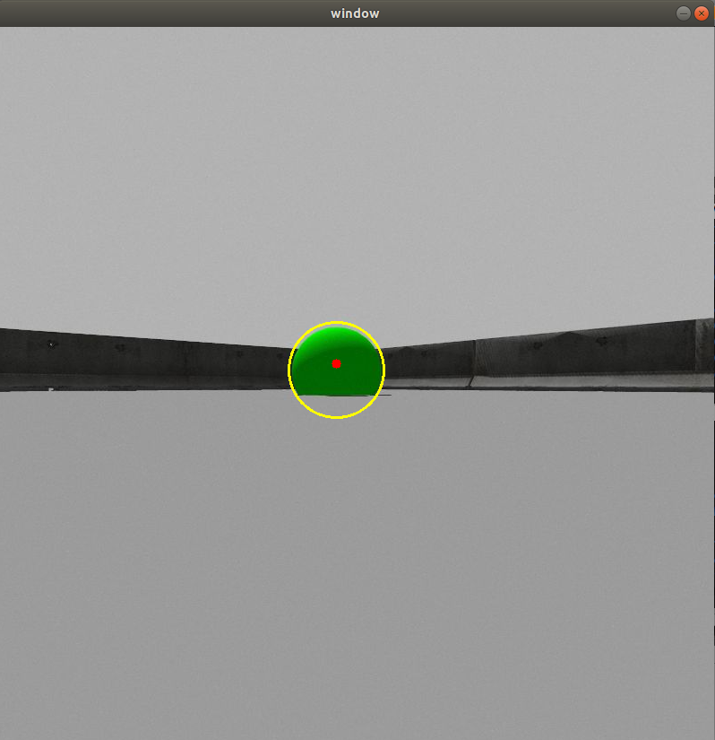
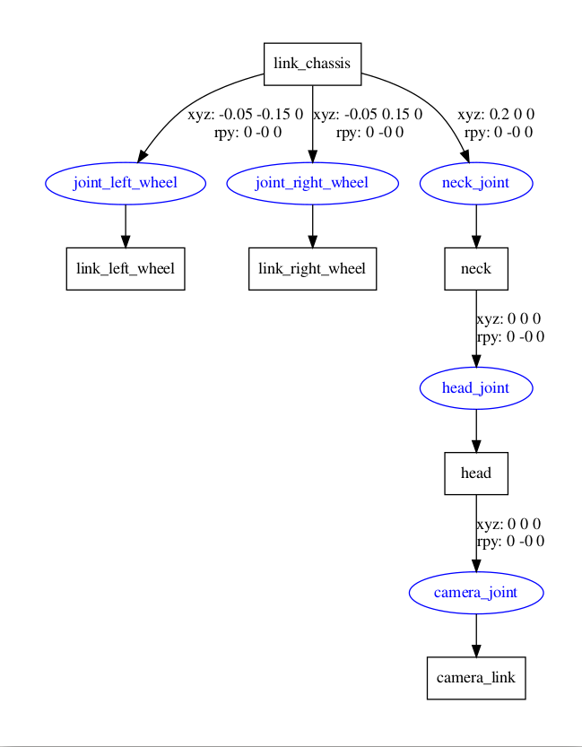
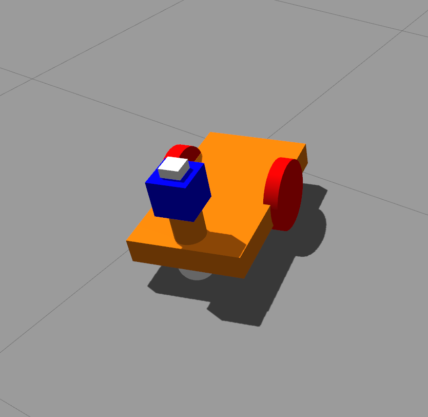

# Assignment 2 - EXPRO
# Introduction
The ROS package simulates a dog robot which can move freely in an arena (gridden area, 8x8) and can have three different behaviors: sleep, normal and play. A green ball is also implemented that can move randomly in the environment. In sleep state, the robot reaches him home (7,7,0) and wait for a while; In normal state, the robot searches the ball: if he finds the ball then he will start to play, otherwise he will move randomly around the arena; In play state, the robot tracks the ball, when he is close to it, then rotates the head, continuing to track the ball as well. The robot is a wheeled dog robot and the differential drive plugin is used, he has a neck (fixed joint), a head (that can rotate with respect z axis) and a camera on the top; instead the ball is a robot with one link and the planar_move plugin. The nodes are written in Python and the environment used for the simulation is Gazebo. The motions of both robots are implemented with two actionlib client-server, and the visualization of the camera is allowed by OpenCV: CV_bridge library is used to interface ROS and OpenCV by converting ROS images into OpenCV images, and vice-versa.

## Software achitecture and states diagrams
The system is composed by four nodes, written in Python, present in the Scripts folder:

"go_to_point_ball.py" is the actionlib server to move the ball;
"go_to_point_robot.py" is the actionlib server to move the robot;
"move_ball_around.py" is the actionlib client to move the ball (it simulates the human commands);
"state_machine.py" is the node in which the state machine is implemented for simulating the three behaviors of the robot.
A launch file "gazebo_world.launch" is provided to start gazebo, to run simultaneously every nodes and to launch the spawner for the robots.

## Go_to_point_ball.py
The node implements the actionlib server to move the ball. The ball can move around in the arena, and can disappear, moving along z axis (it is possible to do this, because the ball has been defined with no collision elements and zero gravity).

## Go_to_point_robot.py
The node implements the actionlib server to move the robot. It is quite different from the previous node, because the robot is wheeled and it has the differential_drive plugin. The dog robot can move around in the arena.

## move_ball_around.py
It is a simply actionlib client that simulates the human commands for moving the ball. The function "move_ball" is defined to send the goal position to the server (using "/reaching_goal/goal" topic). For twice, the ball reaches a random goal position and waits for 50 secs, then it disappears (moves on z axis) and waits again for 50 secs (In loop).

## State_machine.py
It is the main node because it implements a state machine and allows the dog robot to perform the three possible behaviors (Sleep, Normal and Play).

In order to perform this, Smach library is imported.

In the Normal state, the robot can perform two possible actions (choosen randomly by "user_action" function): can switch in sleep state or can search for the ball, subscribing to the "camera1/image_raw/compressed" topic. Using OpenCV to show the image from the camera, the following window will be opened




If the ball is found, then it switches in Play state, otherwise it moves randomly: "move_dog" function is defined to send the goal position to the server of the robot (using "/robot_reaching_goal/goal" topic).

In the Sleep state, the robot just goes to a desired position (7,7,0) and stays there for a while (14 seconds defined). Then it enters again in Normal state.

In the Play state, the robot starts to follow the ball in the arena; when the ball is reached the robot stops mantaining an appropriated distance from the ball (the "image_feature" instance has been called for doing that); then the robot rotates his head to the left, waits for a while, and rotates again to the right side and waits for a while as well. Once he completed his performance, continues to track the ball and follows it. In case the ball disappers, the robot enters in Normal state.

# ROS messages and Parameters
In the Action folder, the "Planning.action" is defined. This ROS message is used by the two server-client actionlib. It includes:

goal: geometry_msgs.msgs/Pose Stamped target_pose
result: uint32 reached_position
feedback: string stat, geometry_msgs.mgs/Pose position
The ROS parameters are used in state_machine node; they are:

count: Used in Play state; it goes from 0 to 360 and counts the num of time in which the robot does not see the ball (it is able to perform an entire turn on itself); when it gets equal to 360, then he passes in Normal state.
camera_rotate:Used in Play state as well. It is a boolean parameter, always setted to 0, but when the robot reaches the ball it is set to 1, in order to start to rotate the head.
count2: it has the same purpuse of the "count" parameter, but used in Normal state.
DetectedBall: Used in Normal state. It is a boolean parameter: switches to 1 when the ball is detected, in order to enter in Play state.
# Package and file list
There exists some folders in the package:

World folder: contains the ROS world file, ti create the environment in Gazebo (gridden arena).





Urdf folder: cointains the xacro, urdf and gazebo files of the robot, the ball and the human. Here the URDF models are defined.


Launch folder: cointains the launch file.
Scripts folder: cointains the Python files (already discussed in the previous paragraph)
Config folder: contains the config file for the single motor of the robot (used to rotate the head - yam).
Action folder: contains the action file (already discussed as well).
According to the ROS package, the CMakeLists.txt and package.xml are present too.

# Installation
The first thing to do, after having cloned the repository in the Ros workspace, is to install the package, using the following commands in the shell:

```
cd "yourWorkspace"_ws/src/exp_assignment2
chmod +x install.sh 
./install.sh 

```
Then, run the system:

```
roslaunch exp_assignment2 gazebo_world.launch

```
# System's features
This system is improving the previous assignment. The environment is simulated with the Gazebo GUI. Moreover, what the robot is doing and what the behavior's state is executing are printed on the Terminal.

# System's limitations and technical improvements
Sometimes, in Play state, the num of interactions ("count" parameter) finishes before to check the presence of the ball in the arena: this means that the robot cannot perform an entire turn on itself and he cannot see the ball, so enters in the Normal state. Nevertheless, in the normal state, before to move randomly, a checking of the ball presence is done: therefore in case the ball is included, the robot can switch again in Play state.

The view of the dog robot (the xacro file) can be improved, in order to make it look more like a dog.
